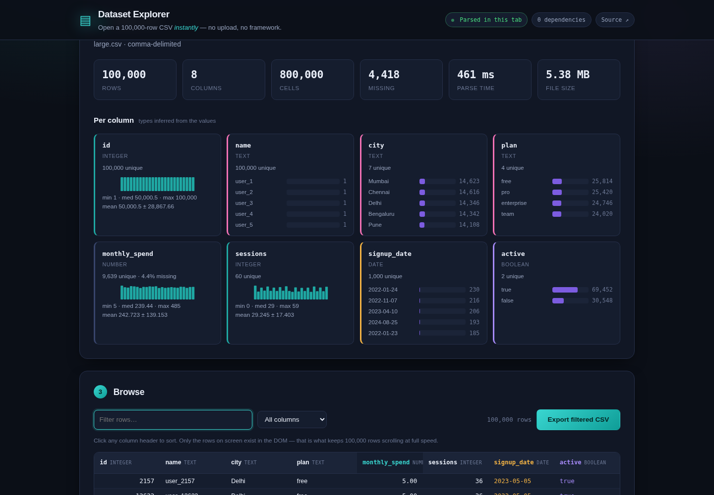

# Dataset Explorer

**Open a 100,000-row CSV instantly. No upload, no framework, no dependencies.**

[](https://devapriyan-s.github.io/dataset-explorer/)
[](https://github.com/Devapriyan-S/dataset-explorer/actions/workflows/tests.yml)
[](LICENSE)

### ▶ [**Open the live demo**](https://devapriyan-s.github.io/dataset-explorer/)



---

## Measured on a 100,000-row, 5.4 MB file

| | |
|---|---|
| Parse time | **461 ms** |
| Rows in the DOM | **36** of 100,000 |
| Scroll frame time | **16.7 ms median, 17.0 ms p95** — a steady 60 fps |
| Sort all 100k rows | **319 ms** |
| Filter all 100k rows | **250 ms** |

Numbers come from the Playwright run in CI, not from a stopwatch.

## The two problems worth solving

### 1. `split(",")` is not a CSV parser

Real exports break it immediately. `web/js/csv.js` is a character-scanning
state machine that handles:

- Quoted fields containing the delimiter — `"Smith, John"`
- Escaped quotes inside quoted fields — `"She said ""hi"""`
- **Newlines inside quoted fields**, which is why you cannot split into lines first
- CRLF endings, and the UTF-8 BOM Excel prepends (left in, your first column is named `id` and every lookup silently misses)
- Semicolon, tab and pipe delimiters, detected by which one yields the most *consistent* field count — counting occurrences alone is fooled by a prose column full of commas
- Ragged rows: short rows are padded and long ones truncated, so one malformed line doesn't destroy the rows around it
- Duplicate and blank header names, disambiguated rather than silently colliding

38 test cases cover exactly these, and run in CI.

### 2. 100,000 `<tr>` elements will freeze the tab

Rendering them all costs tens of seconds up front and then scrolls at
single-digit frames per second. So the grid is **virtualised**: a spacer element
supplies the full scroll height, and only the rows inside the viewport plus a
small overscan actually exist in the DOM — 36 of them, regardless of file size.

Two details make it feel native rather than janky:

- **Scroll events are coalesced into one render per animation frame.** The raw
  event fires far more often than the display refreshes; without this you do
  redundant work and still drop frames.
- **Sorting and filtering operate on an index array**, never on the data itself.
  No row objects are copied or reallocated, so a sort of 100k rows is one
  `Array.sort` over integers.

Blank cells always sort to the bottom regardless of direction — a column of
empty values floating to the top on every sort is pure noise.

## Also included

- **Type inference per column** — integer, number, date, boolean, text — from
  the values, not the header names. A single stray `N/A` doesn't stop a column
  being numeric, but 30% text does. A bare `2019` is an integer, not a date.
- **Per-column statistics**: min/median/max, mean ± SD, outlier count by the
  1.5×IQR rule, and a distribution sparkline for numeric columns; a top-values
  frequency chart for categorical ones.
- **Export the filtered view** back to CSV, with correct re-quoting.

## Run it

```bash
git clone https://github.com/Devapriyan-S/dataset-explorer.git
cd dataset-explorer

npm test                            # 38 parser and inference cases
python -m http.server 8000 -d web   # open http://localhost:8000
```

Use the parser on its own — it has no dependencies:

```js
import { parseTable, inferType, columnStats } from "./web/js/csv.js";

const { columns, rows, delimiter } = parseTable(csvText);
const types = columns.map((_, i) => inferType(rows.map((r) => r[i])));
const stats = columns.map((_, i) => columnStats(rows.map((r) => r[i]), types[i]));
```

## Limits

- **The whole file is held in memory** as strings. Around 200 MB the browser tab
  will struggle; a streaming parser reading `File.stream()` in chunks would be
  the fix, and is not implemented.
- **Parsing runs on the main thread**, so a very large file briefly blocks the
  UI. Moving it to a Web Worker is the obvious next step.
- **Columns are fixed-width** — no drag-to-resize or reordering.
- **Filtering is a plain substring match**, not a query language.

---

MIT licensed. Built by [Devapriyan Sampath](https://github.com/Devapriyan-S).
